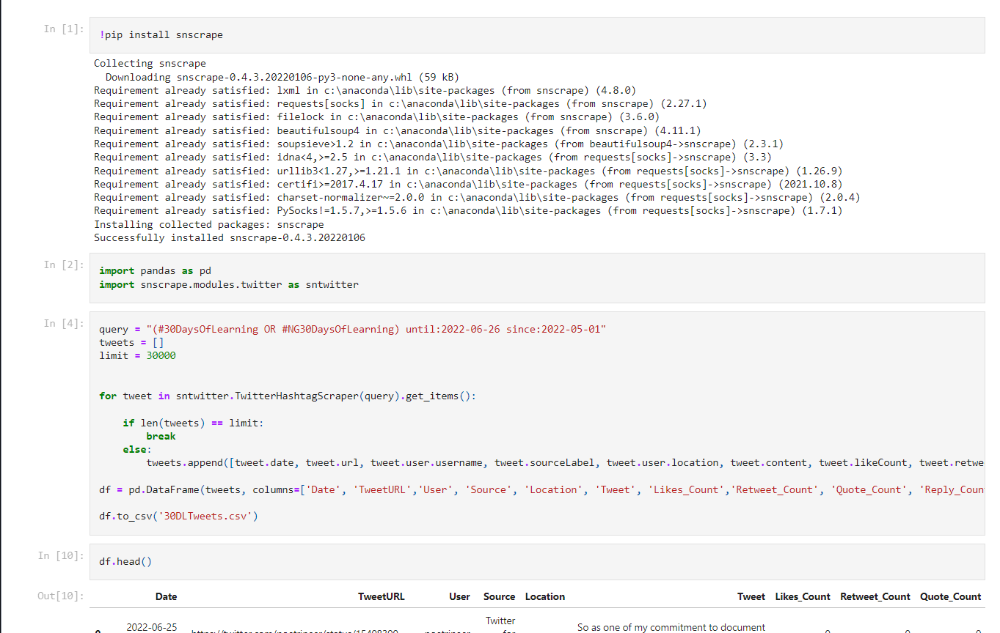
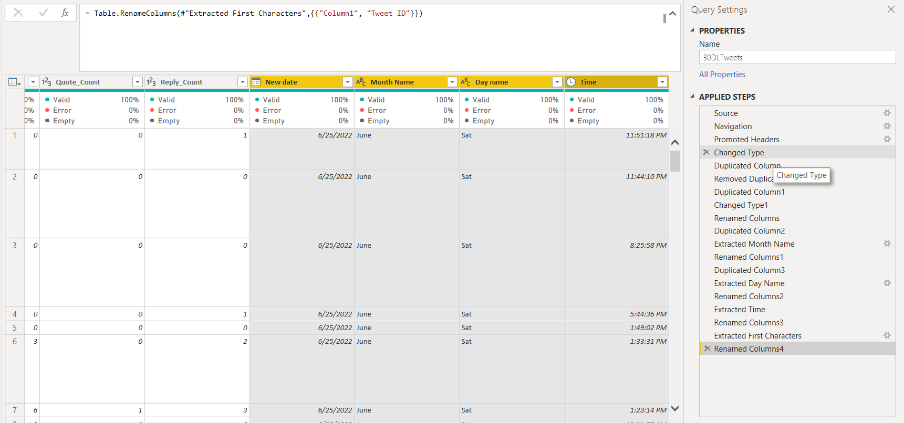
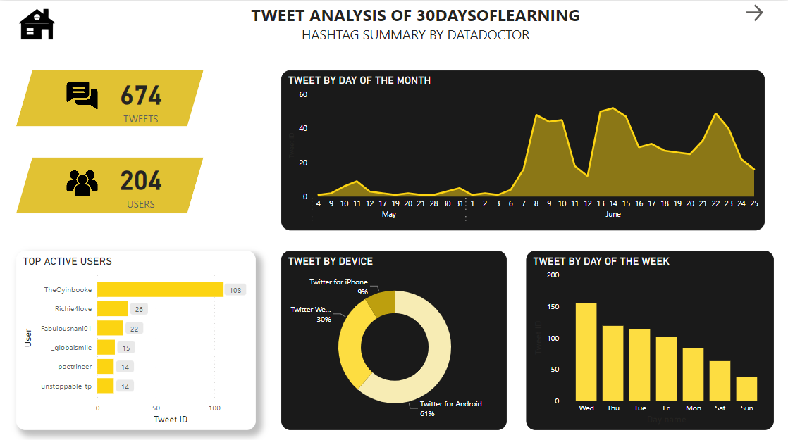
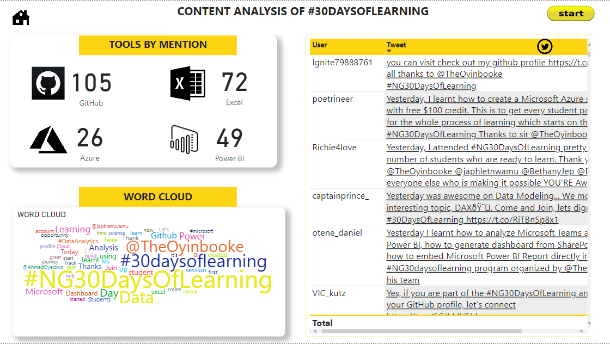
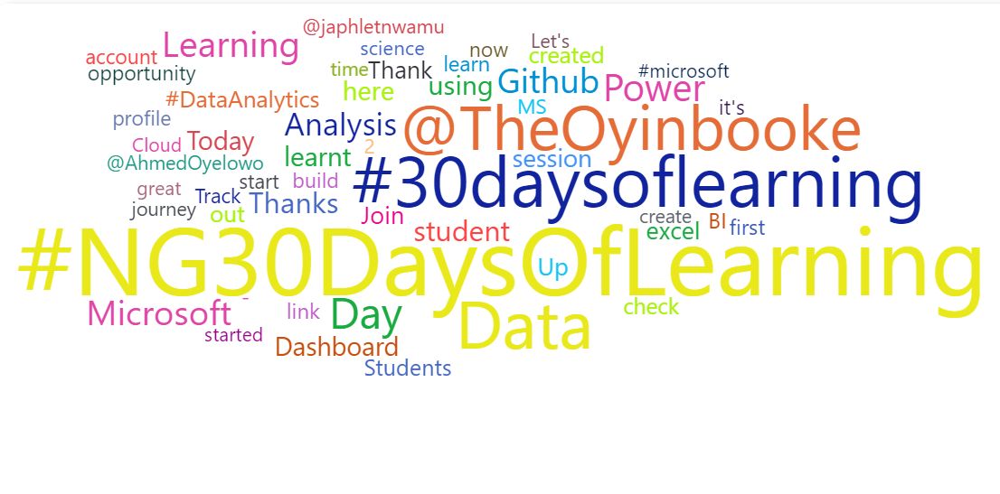
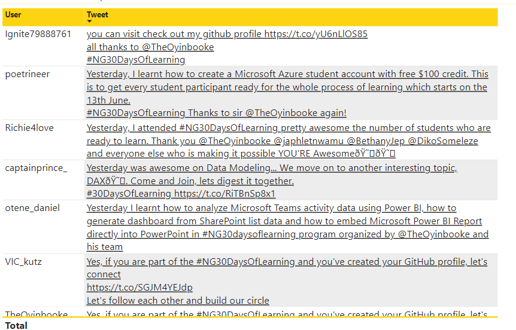
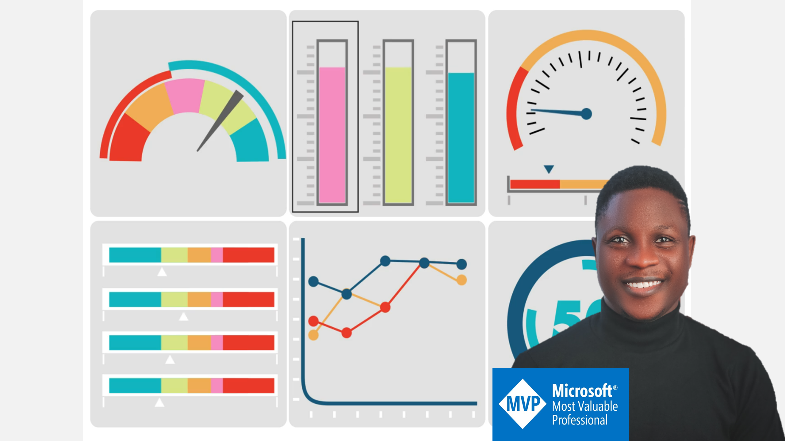
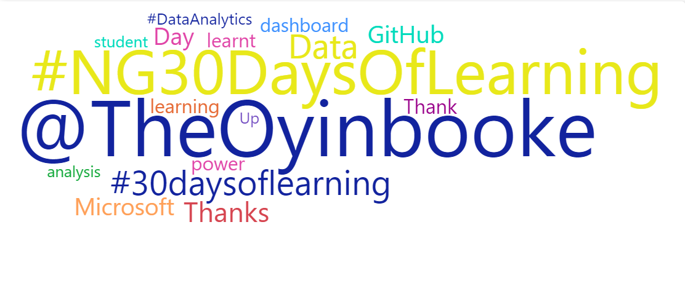

# Twitter-Analysis-Project
------------------

## Introduction
The aim of this project is to exhibit my skills in analyzing and visualizing social media (Twitter) data with user friendly navigation using Power BI.

The Report consists of three pages:
1. Home Page
2. Tweet Summary
3. Content Analysis

## Problem Statement
To analyze and visualize tweets, and trend of hastags:
- #30DAYS OF LEAERNING
- #NG30 DAYS OF LEARNING

The analysis will also include tools mentioned and Word Cloud associated to the hashtags.

## Data Sourcing
Data was scrapped from twitter using Python, downloaded as excel file and then imported into Power BI for analysis.
The code was executed using [Jupyter notebook](https://github.com/Data-Dr-hub/Twitter-Analysis-Project/blob/b24eb765f0c9fa7b85678116b11b8d3be4026e0a/30DLTweetsScrape.ipynb).

The scraped dataset contains 676 rows and 11 columns.

## Data Transformation
Data cleaning and transformation was carried out using Power Query.
After scrutinizing all the columns, they were found to be valid and devoid of empty cells and errors.
However, It was highly important that I transformed the [Date] column which was in the 'date/time' format.

Therefore, I created 4 new columns all extracted from the source [Date] column.
- The first cloumn contained the date in 'date' format (i.e dd/mm/yyy) and named it **"New Date"**.
- The second column was also extracted from the source [Date] column where I extracted the Month hierarchy and named it **'Month Name'**.
- Day Name was also extracted to constitute the third column and named **Day Name** column.
- The last column was created for the time format of the source date column and named **Time**.

The highlighted columns are the newly created columns. You can look through the applied steps as well.

## Data Modelling
No modelling was required since we need just a table for the analysis.

## Analysis and Visualization
----------
 **Tweet Summary**

Here, we could discover the following insights:
1. There has been 674 tweets from 204 people within the first 2 months of showcasing the #30days of learning program on twitter.
2. There has been an exponential increase in amount of tweet in June from the first month May.
3. "The Oyinbooke" is the most active user of the hashtags.
4. 61% of those engaging with the hashtag do it using Android devices.
5. Just 9% of the users tweet with iPhone.
6. The users engage mostly on weekdays especially Wednesday and lowest on weekends.
------
**Content Analysis**

This page displays more in-depth analysis about what the users are talking about with the hashtag.
The page report depicts the following:
1. GitHub was the most mentioned tool while Azure was the least mentioned over the first two months of the program.
2. From the word cloud, the three most recurring hashtags are 
- #NG30DAYSOFLEARNING with 383 mentions,
- #30DAYSOFLEARNING with 263 mentions.

and the most mentioned handle is ofcourse **@TheOyinbooke** who has been mentioned 227 times over the first two months of commencement the learning journey.

This page also depicts a table of Users by tweet which has been embedded with their corresponding URL for easy and direct navigation to the original tweet in order to see what was really discussed by the user and interact with other comments.

## Conclusion & Recommendations

- The sharp increase in the rate and number of tweet from the first to the second month is very commendable. 
My prediction is that the rate would increased more exponentially over this month of July provided that the methods and strategy of broadcast are kept constant or advanced further.
- **Mr Oyinbooke** is pivotal to the broadcast and and engagement in this program. 

This only shows how passionate he is about learning, teaching and education generally.
Being a Microsoft Senior Advocate and MVP, it will be nice to have him explain how he multitasks and keep motivated.

- Majority of the users of the #30days of learning are android users. 

Therefore, they should be considered first in the choice of required softwares and applications for the learning process. As a matter of fact, the program as a whole has to be Android compatible. This is Nigeria! :smile: 
- People engage less on weekends which is expected because people tend to fix most of their extracurricular activities on weekends. Therefore, I recommend that urgent lectures and live events should not be fixed on weekends as it is most likely that majority would miss the event and that would not be encouraging.

- There is a high probablity that majority of students enrolled for the data analytics track, evidenced by the mention of tools.

Excel and Power BI were mentioned the most and these are primary tools of data analytics. (that is the track I enrolled for as well :nerd_face:)
- The #NG30DAYSOFLEARNING is more often used than the #30DAYSOFLEARNING hashtag.(well, I initially thought otherwise because of the length of the hashtag)
- Being the convener of the learning program, I went ahead to filter for "@Oyinbooke";

words including 'data analytics', 'GitHub', 'Learning'.
It is not surprising to have 'GitHub' as one of the most mentioned words because he constantly encourages students to upload projects no matter how small.
----------
Note: 
- There is a nice hover and press effect/style in the buttons on the home page. Interact [HERE]()
- The Home icon navigates to the home page.
- The start button on the content analysis page directs to the Onboarding page of the learning program to get started with 30DAYSOFLEARNING.

Thanks for following through.
